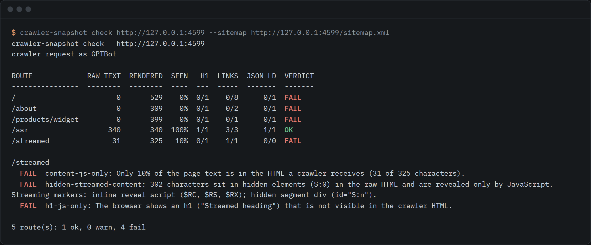

# crawler-snapshot

[](LICENSE)
[](package.json)

Find out what AI and search crawlers really see on your JavaScript site, then save real HTML for them using the Chrome you already have. Free, self-hosted, no account.



<details>
<summary>The same output as text</summary>

```text
$ crawler-snapshot check http://127.0.0.1:4599 --sitemap http://127.0.0.1:4599/sitemap.xml

crawler-snapshot check   http://127.0.0.1:4599
crawler request as GPTBot

ROUTE             RAW TEXT  RENDERED  SEEN   H1  LINKS  JSON-LD  VERDICT
----------------  --------  --------  ----  ---  -----  -------  -------
/                        0       529    0%  0/1    0/8      0/1  FAIL
/about                   0       309    0%  0/1    0/2      0/1  FAIL
/products/widget         0       399    0%  0/1    0/1      0/1  FAIL
/ssr                   340       340  100%  1/1    3/3      1/1  OK
/streamed               31       325   10%  0/1    1/1      0/0  FAIL

/streamed
  FAIL  content-js-only: Only 10% of the page text is in the HTML a crawler receives (31 of 325 characters).
  FAIL  hidden-streamed-content: 302 characters sit in hidden elements (S:0) in the raw HTML and are revealed only by JavaScript. Streaming markers: inline reveal script ($RC, $RS, $RX); hidden segment div (id="S:n").
  FAIL  h1-js-only: The browser shows an h1 ("Streamed heading") that is not visible in the crawler HTML.

5 route(s): 1 ok, 0 warn, 4 fail
```

</details>

That is the fixture in `tests/fixture`, a small vanilla JS app built to fail. The detail lines for the other three failing routes are left out here. The full output and the JSON report have them.

## Run it

```sh
npx crawler-snapshot check https://your-site.example --crawl
```

You need Chrome, Edge or Chromium installed. The tool drives it and downloads nothing. Node 18.3 or newer.

## Why this exists

On 20 August 2026 we found that all 123 routes of reidify.design were serving their whole page inside a `<div hidden>` after the footer. It had been that way for months.

The cause was one Suspense boundary above the route tree. When the site was prerendered, React took its streaming path: it wrote a loading placeholder into `<main>`, wrote the real page into a hidden div later in the document, and added a small inline script to move one into the other. The site's Content Security Policy only allows scripts from itself plus a few hashes, so that inline script never made it into the built files. The policy was right and the build was wrong.

Browsers never showed the problem, because React rebuilds the page when it mounts. Only readers of the served HTML were affected, which is exactly who prerendering is for. Measured on one route, the text inside `<main>` went from 160 characters to 42,645 after the fix. With JavaScript off, a route went from an empty `<main>` to between 1,937 and 7,195 characters. The first heading a crawler met had been the footer's wordmark.

A check that counted characters did not catch it, because characters inside a hidden div are still characters. The check that did catch it read document structure. `crawler-snapshot check` is that second kind of check, made general. `snapshot` and the serve examples are the fix for sites that cannot move to server rendering.

## What it does

| Command | What it does |
|---|---|
| `check` | Fetches each route the way a non-rendering crawler does (one request, a crawler User-Agent, no JavaScript), renders the same URL in your browser, and compares them. |
| `snapshot` | Renders routes in your browser and writes `out/<route>/index.html` plus a `manifest.json`. Resumable. |
| `agents` | Prints the crawler list the serve examples use, with sources. |

## check

```sh
crawler-snapshot check https://your-site.example                     # one page
crawler-snapshot check https://your-site.example --crawl --depth 2   # follow links
crawler-snapshot check https://your-site.example --sitemap https://your-site.example/sitemap.xml
crawler-snapshot check https://your-site.example --routes routes.txt --json report.json
crawler-snapshot check https://your-site.example --as ClaudeBot --fail-on warn
```

For every route it compares the raw response with the rendered DOM:

- visible text length, headings, and links
- JSON-LD blocks, and whether each one is valid JSON
- title, meta description, canonical link, robots meta tag
- content that is in the markup but hidden until a script runs, and the markers React-style streaming leaves behind (`$RC(...)`, `<!--$?-->`, `id="S:0"`, `id="B:0"`)

Each route gets OK, WARN or FAIL, and each finding says what it saw. The lines are in `src/analyze.js` and exported as `THRESHOLDS`: text under 50% of the rendered text fails, under 85% warns. `--json` writes the full report, with both measurements for every route. The exit code is 1 when anything fails (`--fail-on warn` also fails on warnings, `--fail-on never` never does), so it works as a CI step.

`--as` picks the crawler for the raw request. Where the vendor publishes a full User-Agent string it is used. Where it does not (Anthropic, for one), the output says a generic string was used.

## snapshot

```sh
crawler-snapshot snapshot https://your-site.example --out out
crawler-snapshot snapshot https://your-site.example --sitemap https://your-site.example/sitemap.xml
crawler-snapshot snapshot https://your-site.example --routes routes.txt --wait-for "main h1"
```

- **Routes** come from a sitemap URL (indexes are followed), a routes file (one route or URL per line, or a JSON array), or a same-origin link crawl from the base URL. A crawl defaults to depth 2 and 100 pages, reads `robots.txt`, and skips files such as PDFs and images. Only the origin you gave is visited.
- **Waiting.** It waits for the load event, network idle, your `--wait-for` selector if you gave one, then until the DOM has been quiet for `--settle` milliseconds (default 500). That last step catches content added by a timer or a lazy chunk after the network goes quiet.
- **Output.** `out/about/index.html` for `/about`, `out/index.html` for `/`. Application `<script>` tags are removed so the file does not run twice in a crawler that does execute scripts. JSON-LD is kept. `--keep-scripts` keeps everything.
- **manifest.json** has, per route: status, bytes, title, JSON-LD block count, render time, and the error if there was one. Error pages (HTTP 4xx and 5xx) and routes that redirect elsewhere are recorded and not saved.
- **Resumable.** Run it again and routes already saved are skipped. `--force` renders everything again.
- **Polite.** Two pages at a time, a 250 ms pause after each. Change it with `--concurrency` and `--delay`.

Snapshot from the URL you will serve from. Canonical links and other absolute URLs in the DOM are written the way the browser saw them.

## Serve the snapshot to crawlers

Every example does the same three things: serve the snapshot to a listed crawler user agent, serve your normal app to everyone else, and send `Vary: User-Agent` so a cache in front does not mix the two up.

**Plain Node http** ([examples/node-http.mjs](examples/node-http.mjs))

```js
import { createServer } from 'node:http';
import { createSnapshotMiddleware } from 'crawler-snapshot/serve';

const snapshots = createSnapshotMiddleware({ dir: 'out' });
createServer((req, res) => snapshots(req, res, () => yourApp(req, res))).listen(3000);
```

**Express** ([examples/express.mjs](examples/express.mjs))

```js
import express from 'express';
import { createSnapshotMiddleware } from 'crawler-snapshot/serve';

const app = express();
app.use(createSnapshotMiddleware({ dir: 'out' })); // before static files and the SPA fallback
app.use(express.static('dist'));
```

**Netlify Edge Function** ([examples/netlify-edge-function.js](examples/netlify-edge-function.js)). Publish the snapshots under `/_snapshots` and put the file in `netlify/edge-functions/`. It only serves a file that starts with this tool's banner comment, because an SPA fallback rule otherwise answers a missing snapshot with your app shell and a 200.

**nginx** ([examples/nginx.conf](examples/nginx.conf)). A `map` on `$http_user_agent` and one `try_files` line.

The Node, Express and Netlify examples are covered by the test suite, including a real Express 4. The Netlify function is tested as a plain function with a fake context, not on Netlify. **The nginx file is not tested at all.** It was written from the nginx documentation and has not been run against nginx. Run `nginx -t` and a `curl` with a crawler User-Agent before you rely on it.

### The crawler list

One data file, [data/crawlers.json](data/crawlers.json), has every user agent with the vendor page it was read from, the date, and whether it was verified. Print it with `crawler-snapshot agents`. The nginx and Netlify examples are generated from it (`npm run sync-examples`), and a test fails if they drift.

Things to know about the list:

- `Google-Extended` and `Applebot-Extended` are in the file, marked as control tokens, and are never served. Google describes Google-Extended as a robots.txt product token, and Apple says Applebot-Extended does not crawl. No request will carry either, so putting them in an allowlist does nothing.
- `bingbot` is marked `partial`. Its User-Agent string was read from Bing's own pages as returned by a search, because the pages did not load for the fetch. Check it before you rely on it.
- For most entries the vendor does not say whether the crawler runs JavaScript, and the file says "not-documented" rather than guessing. Googlebot documents that it does. Apple documents that Applebot may.
- The list is not complete. Add your own with `createSnapshotMiddleware({ userAgents: ['MyBot'] })`.

## Limits

- **It is not a hosted service.** It is a command line tool and a few files you run yourself. There is no dashboard, no cache warmer and no scheduler. Run `snapshot` in your build or on a cron.
- **Snapshots go stale.** A snapshot is a copy from the moment you took it. Anything that changes between runs (prices, stock, dates) is out of date for crawlers until the next run.
- **Static routes only.** Routes are identified by path, and query strings are dropped. Pages that depend on a cookie, a login or a query string need your own routes file and probably a different approach.
- **`check` measures raw text without your CSS.** It parses the raw HTML with JavaScript off and no stylesheets. Text that your CSS would hide still counts as visible on the raw side, so the SEEN column can go over 100%. That errs toward fewer false alarms.
- **Chrome is required, and it is your Chrome.** The output depends on that browser version. Set `CHROME_PATH` to choose one. Inside a root container, set `CRAWLER_PRERENDER_NO_SANDBOX=1`.
- **Gzipped sitemaps are not read.**
- **Server rendering is better where you can have it.** Google says dynamic rendering was a workaround and not a long-term solution ([source](https://developers.google.com/search/docs/crawling-indexing/javascript/dynamic-rendering)). If you can render on the server or at build time, crawlers and people get the same HTML with nothing to keep in sync.
- **Be honest about what you serve.** Serve crawlers the same content people see, only already rendered. Google says similar content is generally not treated as cloaking, and that completely different content can be. Do not use this to show crawlers a different page.

## Tests

```sh
npm install
npm test
```

The suite uses `node:test` and a local fixture site written in vanilla JavaScript: content rendered after load, a section that arrives late, JSON-LD and head tags set by script, and a route that streams its content inside a hidden chunk. The browser tests need a local Chrome, Edge or Chromium and skip with a message if there is none. One test runs the whole loop: snapshot the fixture, serve the snapshot to a crawler, and check that the routes that failed now pass.

## Licence

MIT. See [LICENSE](LICENSE).

Built by @rishsadh at Reidify (reidify.design)
